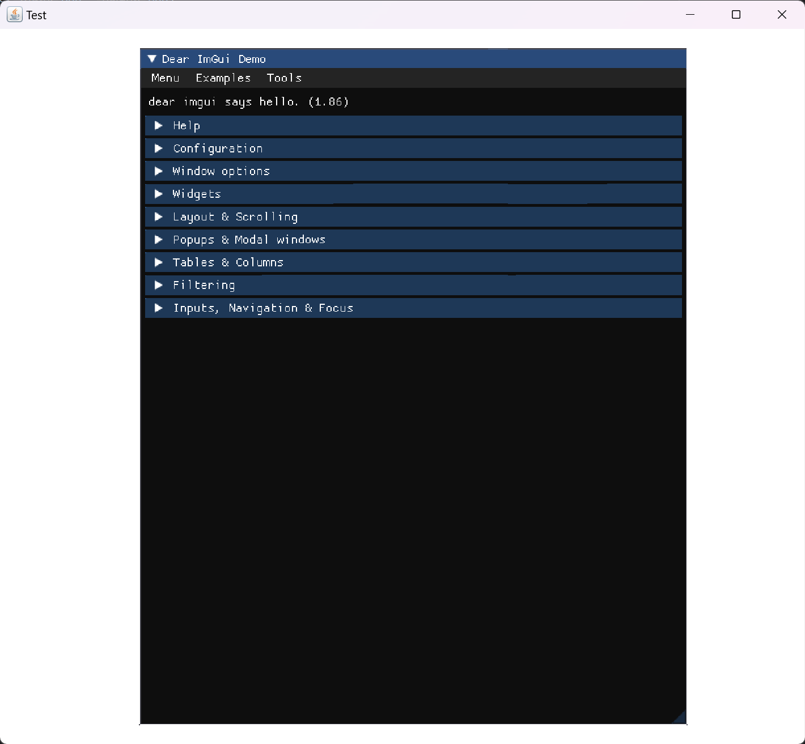

# imgui-swing
Draw ImGui in a Java Swing Panel.



## Disclaimer
This works better than expected but is not perfect. I don't know if it will ever become better. I get around 30FPS on my PC with the example window.

## Supported ImGui features
 - Clip rects
 - Mouse Support (mouse position, mouse buttons, mouse wheel)
 - Keyboard Support (char input, key down, key up)
 - Mouse cursors
 - Textures

## Usage
To use imgui-swing, you need to create a class which extends `ImGuiPanel` and overwrite the `render`method.\
Optionally you can overwrite the `init` method to initialize ImGui.
```java
import net.lenni0451.imgui.swing.ImGuiPanel;

public class MyPanel extends ImGuiPanel {

    @Override
    protected void init() {
        //TODO: Add your ImGui initialization code here
    }

    @Override
    protected void render() {
        //TODO: Render your ImGui code here
    }

}
```
After creating your class, you can simply add it to any Swing component.
```java
//For example the content pane of a JFrame
frame.setContentPane(new MyPanel());
```

## Rendering the example window
If you just want to render the example window, you can just create a new instance of the `ImGuiPanel` class and add it to your component.
```java
frame.setContentPane(new ImGuiPanel());
```

## Full example
This is basically everything you need to do to render ImGui in a JFrame.
```java
JFrame frame = new JFrame("Test");
frame.setSize(800, 600);
frame.setDefaultCloseOperation(WindowConstants.EXIT_ON_CLOSE);
frame.setLocationRelativeTo(null);
frame.setContentPane(new ImGuiPanel());
frame.setVisible(true);
```

## Textures
`imgui-swing` supports textures using the `TextureManager`.\
The textures have to be `BufferedImage`s.\
To load a new texture and get the texture id, you can call the `TextureManager.create(image)` method.
```java
BufferedImage image = ...;
int textureId = TextureManager.create(image);
```
